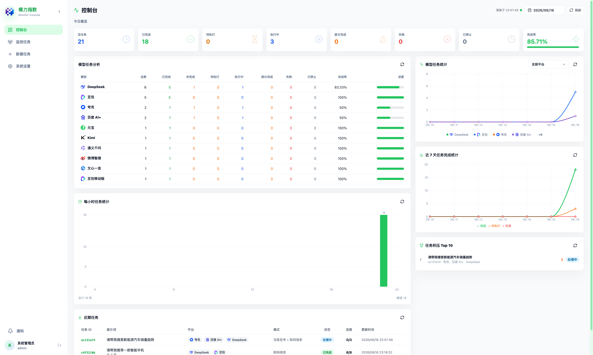
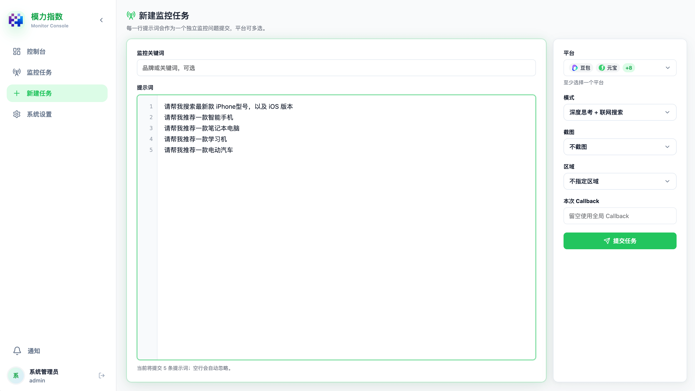
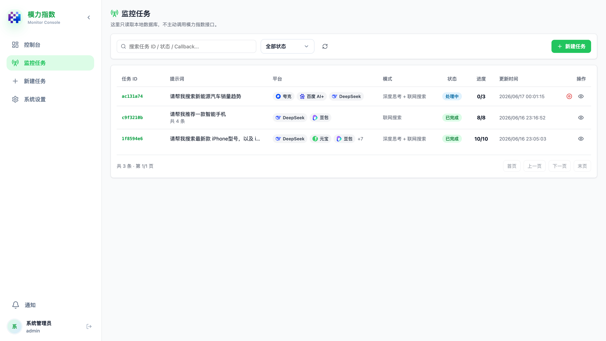
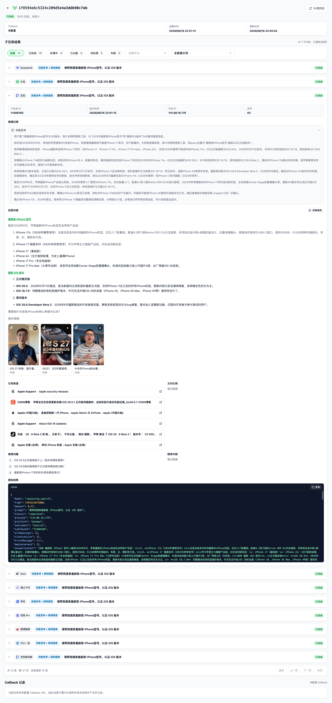

# 模力指数 API 多语言接入 Demo

这是一个面向客户和开发者的模力指数监控 API 多语言接入示例仓库。每个语言目录都是一个完整的后端 API demo，根目录 `frontend/` 是所有后端共享的 React + Vite 管理端。

你可以任选一种语言启动完整环境，也可以同时启动多种语言进行对比测试。

## 官方入口

- 模力指数官网：[https://www.molizhishu.com/](https://www.molizhishu.com/)
- 在线文档：[模力指数在线文档](https://doc.molizhishu.com/docs/intro)

## 目录结构

```text
.
├── frontend/   # 公用 React + Vite 管理端
├── php/        # PHP 8 + ThinkPHP API 接入 demo
├── golang/     # Go + Gin + GORM API 接入 demo
├── java/       # Spring Boot + MyBatis API 接入 demo
├── python/     # Python + FastAPI + SQLAlchemy API 接入 demo
├── dotnet/     # ASP.NET Core + Dapper API 接入 demo
├── rust/       # Rust + Axum + sqlx API 接入 demo
├── react/      # React 技术栈 Node.js API 接入 demo
├── vue/        # Vue 技术栈 Node.js API 接入 demo
└── docs/       # 公用提示词和跨语言资料
```

## 已支持的 demo

- [PHP 8 + ThinkPHP demo](php/README.md)
- [Go + Gin + GORM demo](golang/README.md)
- [Spring Boot + MyBatis demo](java/README.md)
- [Python + FastAPI demo](python/README.md)
- [ASP.NET Core + Dapper demo](dotnet/README.md)
- [Rust + Axum + sqlx demo](rust/README.md)
- [React Node.js API demo](react/README.md)
- [Vue Node.js API demo](vue/README.md)
- 公用前端：[frontend](frontend)
- 公用提示词：[docs/vibecoding-prompt.md](docs/vibecoding-prompt.md)
- 跨语言实现契约：[docs/implementation-contract.md](docs/implementation-contract.md)
- 模力指数 API 文档：[docs/api](docs/api)

## UI 预览

### 控制台



### 新建任务



### 任务列表



### 任务详情



## 快速启动

进入任意语言目录，复制环境变量示例并启动。以下以 Python demo 为例：

```bash
cd python
cp docker.env.example docker.env
sh scripts/docker-up.sh
```

编辑 `docker.env` 时至少配置：

```dotenv
MOLIZHISHU_TOKEN=你的模力指数 API Key
MYSQL_ROOT_PASSWORD=change_root_password
MYSQL_PASSWORD=change_app_password
```

默认访问：

```text
前端：http://127.0.0.1:18000
API：http://127.0.0.1:对应语言端口，见下方端口表
```

默认管理员：

```text
账号：admin
密码：molizhishu
```

生产部署后请修改默认管理员密码，并妥善保管 API Key。

## 默认端口

各语言 API 默认端口如下。Docker 环境中的公共前端默认端口都是 `18000`，可通过 `WEB_PORT` 修改。

| demo | 默认 API 端口 | 说明 |
| :--- | :--- | :--- |
| PHP | `18080` | PHP 8 + ThinkPHP |
| Java | `18081` | Spring Boot + MyBatis |
| Go | `18082` | Gin + GORM |
| Python | `18083` | FastAPI + SQLAlchemy |
| ASP.NET Core | `18084` | Minimal API + Dapper |
| Rust | `18085` | Axum + sqlx |
| React Node API | `18086` | Express + mysql2 |
| Vue Node API | `18087` | Express + mysql2 |

批量测试时建议使用以下前端端口：

| demo | 前端端口 | API 端口 |
| :--- | :--- | :--- |
| PHP | `18000` | `18080` |
| Java | `18001` | `18081` |
| Go | `18002` | `18082` |
| Python | `18003` | `18083` |
| ASP.NET Core | `18004` | `18084` |
| Rust | `18005` | `18085` |
| React Node API | `18006` | `18086` |
| Vue Node API | `18007` | `18087` |

## 公用前端

根目录 `frontend/` 是所有后端 demo 共用的 React + Vite 管理端。各语言目录下的 Docker Compose 都会一键启动当前语言的前端、API、数据库和必要的后台同步进程，默认前端端口为 `18000`。

本地开发或逐语言测试时，也可以让前端在 Docker 外单独运行，并通过 `VITE_API_TARGET` 指定要连接的后端 API：

```bash
cd frontend
npm install
VITE_API_TARGET=http://127.0.0.1:18082 npm run dev -- --host 127.0.0.1
```

例如 Go 版 API 默认端口是 `18082`，启动后访问 `http://127.0.0.1:5173/` 即可使用公共前端连接 Go 后端。

Docker 一键启动示例：

```bash
cd python
cp docker.env.example docker.env
sh scripts/docker-up.sh
```

启动后访问 `http://127.0.0.1:18000`。如需修改前端端口，编辑对应语言目录下的 `docker.env`：

```dotenv
WEB_PORT=18000
```

如果不使用仓库内置前端容器，也可以独立构建前端：

```bash
cd frontend
npm install
npm run build
```

构建产物在 `frontend/dist`。独立部署静态站点时，需要在 Nginx、网关或平台反向代理中把 `/api/` 和 `/webhooks/` 转发到实际后端 API。更多说明见 [frontend/README.md](frontend/README.md)。

## 跨语言一致性

所有语言 demo 需要保持同一套本地 API 行为、字段类型、数据库语义和同步策略。尤其需要注意：

- `/api/tasks` 和 `/api/tasks/{taskId}` 返回给前端的 `prompts_json`、`platforms_json`、`region_code_json` 必须是 JSON 字符串，不是数组对象。
- 远端状态/结果同步不能覆盖本地提交时保存的提示词、平台、区域、Callback 等参数。
- 子任务可能部分完成，不能等主任务全部完成才入库展示。
- 控制台“今日概览”统计的是子任务数，不是主任务条数。
- 修改 API 入参、出参、同步逻辑或数据库字段时，必须同步检查所有语言。

详细规则见 [docs/implementation-contract.md](docs/implementation-contract.md)。

## 数据库规范

- 所有后端 demo 默认连接同一个公共数据库 `molizhishu`，不是按语言拆分成多个库。不同语言的实现只是在代码目录、服务端口和容器名称上隔离。
- 本地 `.env.example` 统一使用 `127.0.0.1:3306/molizhishu`；Docker 部署统一通过 `MYSQL_DATABASE=molizhishu` 创建同名数据库。
- 所有 demo 的业务表统一使用 `geo_` 前缀：`geo_tasks`、`geo_subtasks`、`geo_callback_events`、`geo_compensation_events`、`geo_admin_users`。
- 每个语言目录都提供独立 `database/schema.sql` 和 `docker-compose.yml`。
- Docker 部署默认使用 `TZ=Asia/Shanghai` 和 MySQL `MYSQL_TIME_ZONE=+08:00`。本地数据库 `DATETIME` 字段按东八区本地时间保存；模力指数远端返回的毫秒级时间戳由前端按 `Asia/Shanghai` 显示。

## 开源发布安全检查

推送到 GitHub 前请确认：

- 不提交任何 `.env`、`docker.env`、真实 API Key、生产数据库密码。
- 只提交 `.env.example`、`docker.env.example`。
- `MOLIZHISHU_TOKEN` 在示例文件中必须是空值或 `change_me`。
- 默认管理员密码只用于 demo，生产部署后必须修改。
- 所有新增语言目录都包含 README、Docker Compose、环境变量示例和 `database/schema.sql`。

`.gitignore` 已忽略各语言目录下的 `.env` 和 `docker.env`。
