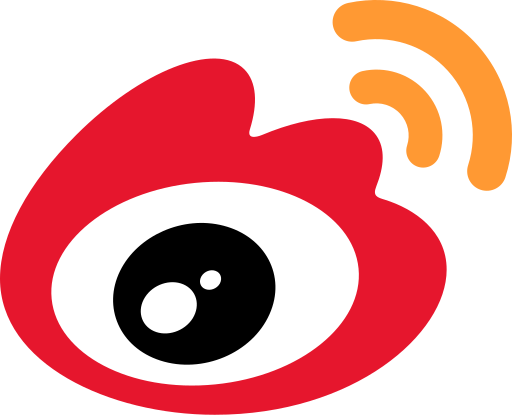
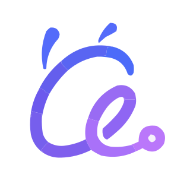

# 提交批量监控任务

**接口地址:** `POST /task/batch/shared`

**接口描述:** 提交批量监控任务，支持多个问题共享相同的平台配置，自动创建子任务并异步执行。任务完成后可通过回调接收推送结果，详见 [Callback 回调](./callback-config)。

**需要认证:** 是

## 请求参数

**请求示例1：基础批量监控（仅提交提示词与平台配置，不涉及品牌分析）:**

> 适用场景：仅需批量执行多个提示词在各 AI 平台的查询，无需跟踪品牌在 AI 回答中的表现。

```json
{
    "prompts": [
        "请帮我搜索最新款 iPhone型号，以及 iOS 版本",
        "请帮我推荐一款智能手机"
    ],
    "platforms": [
      {"platform": "doubao", "mode": "reasoning_search", "screenshot": 1},
      {"platform": "yuanbao", "mode": "search", "screenshot": 1}
    ],
    "consumerTaskId": "consumerTask202608050001"
}
```

**请求示例2：品牌监控（同时配置监控关键词、别名与竞品词）:**

> 适用场景：需要跟踪「监控词」及其「竞品」在 AI 回答中的提及位置、情感倾向、竞品排名等品牌分析指标，会在子任务结果中返回 `mentionPosition`、`sentiment`、`competitorRankings` 等品牌分析字段；同时配置 `callbackUrl`，在任务完成后异步接收推送结果。

```json
{
    "monitorKeywords": "华为",
    "monitorKeywordAliases": ["HUAWEI", "华为手机"],
    "competitors": [
        {
            "name": "小米",
            "aliases": ["Xiaomi", "小米手机"]
        },
        {
            "name": "苹果",
            "aliases": ["Apple", "iPhone"]
        }
    ],
    "prompts": [
        "目前市场上销量较高的手机品牌有哪些"
    ],
    "platforms": [
        {"platform": "doubao", "mode": "reasoning_search", "screenshot": 1}
    ], 
    "callbackUrl": "https://your-domain.com/callback"
}
```

**参数说明:**

| 字段名 | 类型 | 必需 | 描述                                                                                                                                                             | 示例值 |
|--------|------|------|----------------------------------------------------------------------------------------------------------------------------------------------------------------|--------|
| monitorKeywords | String | 否 | 监控关键词                                                                                                                                                          | "华为" |
| monitorKeywordAliases | List&lt;String&gt; | 否 | 监控词别名列表，**最多 50 个**                                                                                                                                                  | ["HUAWEI", "华为手机"] |
| competitors | List&lt;CompetitorBrand&gt; | 否 | 竞品词列表（含别名），**最多 50 个**；当 `competitors` 中存在名称不为空的项时，`monitorKeywords` 必填                                                                                        | - |
| prompts | List&lt;String&gt; | 是 | 监控提示词列表，每个提示词生成一个子任务，**最多 50 个**                                                                                                                               | ["目前市场上销量较高的手机品牌有哪些"] |
| platforms | List&lt;PlatformConfig&gt; | 是 | 平台配置列表，详见下方说明，同一平台名称重复时自动去重                                                                                                                                    | - |
| regionCode | List&lt;String&gt; | 否 | 区域代码列表，指定节点使用的区域，格式为行政区划代码（如：410000-河南省）。可用代码通过 `/api/business/eip-edge/ports/city-info` 接口获取，详见[获取可用区域列表](./city-proxy)。**当前仅支持指定 1 个 regionCode（数组长度必须为 1）**；**注意：移动端平台暂不支持地区设置，且不保证均匀随机。** | ["410000"] |
| callbackUrl | String | 否 | 任务级 callback 地址，仅对本次任务生效；未提供时使用全局 callback 地址。详见 [Callback 回调](./callback-config)                                                                              | "https://your-domain.com/callback" |
| consumerTaskId | String | 否 | 客户侧任务唯一标识，**仅用于提交幂等**。为空或不传时不启用幂等；如需启用，须填写 **8~64 个字母或数字**。相同 `consumerTaskId` 重复提交时，会返回首次创建的任务且不重复扣费。详见下方[提交幂等](#提交幂等) | "consumerTask202606300001" |

**PlatformConfig 对象说明:**

| 字段名 | 类型 | 必需 | 描述 | 可选值 |
|--------|------|------|------|--------|
| platform | String | 是 | AI平台名称 | "deepseek"、"doubao"、"yuanbao" 等 |
| mode | String | 是 | 监控模式，详见[概述](./overview#监控模式说明) | "standard"、"reasoning"、"search"、"reasoning_search" |
| screenshot | Integer | 否 | 是否截图（默认：0） | 0-不截图、1-截图、2-提及截图 |

**CompetitorBrand 对象说明**

| 字段名 | 类型 | 必需 | 描述 |
|--------|------|------|------|
| name | String | 否 | 竞品名称 |
| aliases | List&lt;String&gt; | 否 | 竞品别名列表 |

### 支持的 AI 平台列表

| platform | 平台名称 | 平台描述 |
| -------- | -------- | -------- |
| &nbsp;`deepseek` | DeepSeek | 领先的国产自研大模型，性能强劲。 |
| &nbsp;`doubao` | 豆包 | 字节跳动旗下的智能 AI 助手。 |
| &nbsp;`yuanbao` | 元宝 | 腾讯出品的 AI 助手，连接微信生态。 |
| &nbsp;`kimi` | Kimi | 月之暗面出品，支持长文本处理。 |
| &nbsp;`qianwen` | 通义千问 | 阿里巴巴自研大模型，功能全面。 |
| &nbsp;`quark` | 夸克 | 夸克浏览器内置 AI，主打搜索与学习。 |
| &nbsp;`baiduai` | 百度文心 | 百度智能搜索，不支持深度思考。 |
| &nbsp;`weibo_zhisou` | 微博智搜 | 微博推出的 AI 搜索。 |
| &nbsp;`antafu` | 蚂蚁阿福 | 蚂蚁集团旗下 AI 健康助手。 |
| &nbsp;`douyinai` | 抖音AI | 抖音AI搜索。 |
| &nbsp;`chatgpt` | ChatGPT | OpenAI 聊天模型。 |
| &nbsp;`doubao_mobile` | 豆包移动版 | 豆包移动端正在升级维护，暂时无法提交任务。 |
| &nbsp;`deepseek_mobile` | DeepSeek 移动端 | DeepSeek 移动端版本。 |
| &nbsp;`qianwen_mobile` | 通义千问移动端 | 通义千问移动端版本。 |
| &nbsp;`yuanbao_mobile` | 元宝移动端 | 元宝的移动端版本。 |
| &nbsp;`baidu_mobile` | 百度文心移动端 | 百度文心移动端，不支持深度思考。 |

### 参数去重规则

系统会对提交的参数自动去重处理，确保不会为同一问题重复创建相同平台的监控任务：

- **platforms 去重**：按 `platform` 名称（不区分大小写）去重，保留首次出现的配置。例如提交 3 个 `deepseek` + 1 个 `kimi`，实际只会创建 `deepseek` 和 `kimi` 共 2 个平台的任务
- **任务数计算**：`totalTask = prompts数量 × 去重后的platforms数量`，请以响应中返回的 `totalTask` 为准

## 响应结果

```json
{
    "success": true,
    "code": 200,
    "message": "批量任务已提交",
    "data": {
        "taskId": "05c517d143cd4f229786d294942b5a96",
        "consumerTaskId": "consumerTask202606300001",
        "totalTask": 1,
        "status": "pending",
        "pollUrl": "/api/business/monitor/task/status/05c517d143cd4f229786d294942b5a96",
        "subTaskList": [
            {
                "subTaskId": "1037398",
                "prompt": "目前市场上销量较高的手机品牌有哪些",
                "platform": "doubao",
                "mode": "reasoning_search",
                "status": "pending",
                "monitorKeywords": "华为",
                "monitorKeywordAliases": [
                    "HUAWEI",
                    "华为手机"
                ],
                "competitors": [
                    {
                        "name": "小米",
                        "aliases": [
                            "Xiaomi",
                            "小米手机"
                        ]
                    },
                    {
                        "name": "苹果",
                        "aliases": [
                            "Apple",
                            "iPhone"
                        ]
                    }
                ]
            }
        ],
        "callbackUrl": "https://your-domain.com/callback"
    }
}
```

**响应字段说明:**

| 字段名 | 类型 | 描述 |
|--------|------|------|
| taskId | String | 批量任务ID（UUID格式） |
| consumerTaskId | String | 客户侧任务唯一标识，仅用于提交幂等；提交时未提供则为 `null` |
| totalTask | Integer | 子任务总数 |
| status | String | 任务状态（pending-待执行） |
| pollUrl | String | 状态轮询地址 |
| callbackUrl | String | 本次任务实际生效的 callback 地址（任务级优先于全局，均未配置时为 `null`） |
| subTaskList | Array | 子任务列表 |
| subTaskList[].subTaskId | String | 子任务ID |
| subTaskList[].prompt | String | 监控提示词 |
| subTaskList[].platform | String | AI平台 |
| subTaskList[].mode | String | 监控模式 |
| subTaskList[].status | String | 子任务状态 |
| subTaskList[].monitorKeywords | String | 监控关键词 |
| subTaskList[].monitorKeywordAliases | List&lt;String&gt; | 监控词别名列表 |
| subTaskList[].competitors | List&lt;CompetitorBrand&gt; | 竞品词列表（含别名） |

## 提交幂等

为避免网络重试或超时重发导致**重复建单、重复扣费**，提交接口支持通过 `consumerTaskId` 实现幂等。

| 请求参数 | 幂等行为 |
|---|---|
| 传入 `consumerTaskId` | 启用幂等，相同标识直接返回首次创建的任务 |
| 未传 `consumerTaskId` | 不启用幂等，每次提交都会新建任务并正常扣费 |

> `consumerTaskId` 仅用于提交幂等。请保存提交响应中的 `taskId`，并使用 `taskId` 查询任务状态和结果。

### 使用 consumerTaskId

由客户端为每次业务提交生成一个唯一的 `consumerTaskId`（8~64 位，仅允许字母和数字）：

- **相同 `consumerTaskId`**：直接返回**已创建**的任务（`message` 为 `"任务已存在"`），不重复扣费、不重复创建子任务。

:::tip
建议将 `consumerTaskId` 与您业务系统中的订单号或请求流水号绑定。一次业务提交固定一个 `consumerTaskId`，重试时复用同一个值即可获得幂等保证；查询任务时仍使用系统返回的 `taskId`。
:::
